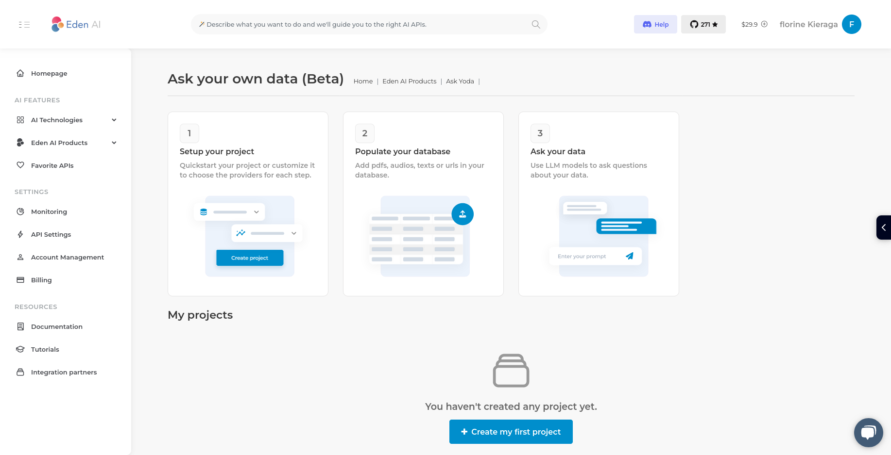

# Unity Eden AI Plugin

The Unity Eden AI Plugin provides easy integration with the Eden AI API to perform various AI tasks such as text-to-speech conversion, chatbot interactions, and more within your Unity applications.

**Table of Contents**

- [Installation](#installation)
- [Getting Started](#getting-started)
- [Usage](#usage)
  - [Initialize the EdenAI API](#initialize-the-edenai-api)
  - [Chat](#chat)
    - [SendChatRequest](#sendchatrequest)
      - [Parameters](#parameters)
      - [Return Value](#return-value)
      - [Example Usage](#example-usage)
  - [Text to Speech](#text-to-speech)
    - [SendTextToSpeechRequest](#sendtexttospeechrequest)
      - [Parameters](#parameters-1)
      - [Return Value](#return-value-1)
      - [Example Usage](#example-usage-1)
  - [Ask your data](#ask-your-data)
    - [SendYodaRequest](#sendyodarequest)
      - [Parameters](#parameters-2)
      - [Return Value](#return-value-2)
      - [Example Usage](#example-usage-2)
  - [Translation](#translation-coming-soon)
  - [Image Generation](#image-generation-coming-soon)
  - [Spell Check](#spell-check-coming-soon)
  - [Sentiment Analysis](#sentiment-analysis-coming-soon)
  - [Summarize](#summarize-coming-soon)
  - [Speech Analysis](#speech-analysis-coming-soon)
  - [OCR](#ocr-coming-soon)
  - [Explicit Content Detection](#explicit-content-detection-coming-soon)
  - [Image Generation](#image-generation-coming-soon)

## Installation
To use the Unity Eden AI Plugin in your Unity project, follow these steps:
1. Open your Unity Package Manager
2. Add package from git url : [https://github.com/edenai/unity-plugin.git](https://github.com/edenai/unity-plugin.git)
## Getting Started
To get started with the Unity EdenAI Plugin, you should:
1. [Install the Plugin](#installation).
2. [Obtain an Eden AI API Key](https://app.edenai.run/user/register?referral=github-unity) if you haven't already.
3. You need to provide your EdenAI API Key to use this plugin. You can set it in your script or
add a file `auth.json` to your user folder (path: `~/.edenai` (Linux/Mac) or `%USERPROFILE%/.edenai/` (Windows))
as follows:
```json
{
  "api_key": "YOUR_EDENAI_API_KEY"
}
```
4. Follow the [usage](#usage) instructions provided below.

## Usage
### Initialize the Eden AI API
You can create an instance of the `EdenAIApi` class by passing your API key as a parameter.
If the API key is not provided, it will attempt to read it from the auth.json file in your user folder.
```csharp
using EdenAI;

EdenAIApi edenAI = new EdenAIApi("YOUR_EDENAI_API_KEY");
```
### Chat
You can use the plugin to chat with natural language processing models in your Unity project.
#### SendChatRequest
This function is designed to send a request for chat and retrieve the generated text.
In case of errors, a `System.Exception` will be raised.
#### Parameters
* **provider** (string) : The data will be redirected to a single provider to obtain the processed results (ex : "openai").
For a list of available providers, please refer to our [documentation](https://docs.edenai.co/reference/text_chat_create).
* **text** (string) : The input text for the chat conversation.
* **chatBotGlobalAction** (string) _(optional)_: A system message that helps set the behavior of the assistant. For example, "You are a helpful assistant".
* **previousHistory** (List<ChatMessage>) _(optional)_: A list containing all the previous conversations between the user and the chatbot AI.
Each item in the list should be a ChatMessage object, which contains **Role** (`user` or `assistant`) and **Message** (the text of the conversions from the respective role). For example : new List<ChatMessage>(new ChatMessage() { Role = "assistant", Message = "Hi, how can I help You ?"}).
* **model** (string) _(optional)_ : The specific model to use for the given provider (ex : "gpt-3.5-turbo").

#### Return Value
This function returns a `ChatResponse` object, which contains :
* **status** (string) : `fail` or `success`
* **provider** (string) : The provider used to process the data.
* **generated_text** (string) :  The generated text by the chatbot AI.
* **message** (List<ChatMessage>) : The messages between the `user` and the `assistant`.
* **cost** (double) : The cost of the api call.

#### Example Usage
```csharp
using EdenAI;
using System;
using System.Threading.Tasks;

class Program
{
    static async Task Main(string[] args)
    {
        string provider = "openai";
        string text = "Hello I'm fine and you ?";
        ChatMessage chatMessage = new ChatMessage()
        {
            Role = "assistant",
            Message = "Hello how are you ?"
        };
        List<ChatMessage> previousHistory = new List<ChatMessage>{ chatMessage };
        EdenAIpi edenAI = new EdenAIApi();
        ChatResponse response = await edenAI.SendChatRequest(provider, text, previousHistory: previousHistory);
    }
};
```
### Text to Speech
You can use the plugin to convert text to speech in your Unity project.
In case of errors, a `System.Exception` will be raised.
#### SendTextToSpeechRequest
This function is designed to send a request for text-to-speech conversion and retrieve the generated audio output.

<a id="parameters-1"></a>
#### Parameters
* **provider** (string) : The data will be redirected to a single provider to obtain the processed results (ex : "amazon").
  For a list of available providers, please refer to our [documentation](https://docs.edenai.co/reference/audio_text_to_speech_create).
* **text** (string) : The text to analyze.
* **audioFormat** (string) : The audio format in which the audio will be generated (ex : "mp3").
* **option** (TextToSpeechOption) : Specifies the voice for the generated speech. You can choose from the following
options: `TextToSpeechOption.FEMALE` or `TextToSpeechOption.MALE` 
* **language** (string) : The language code (ex : "en").
For a list of available languages, please refer to our [documentation](https://docs.edenai.co/reference/audio_text_to_speech_create).
* **rate** (int) _(optional)_ : Increase or decrease the speaking rate by expressing a positif or negatif number ranging
between 100 and -100 (a relative value as percentage varying from -100% to 100%)
* **pitch** (int) _(optional)_ : Increase or decrease the speaking pitch by expressing a positif or negatif number
ranging between 100 and -100 (a relative value as percentage varying from -100% to 100%)
* **volume** (int) _(optional)_ : Increase or decrease the audio volume by expressing a positif or negatif number
ranging between 100 and -100 (a relative value as percentage varying from -100% to 100%)
* **voiceModel** (string) _(optional)_ : The specific model to use for the given provider (ex : "en-US_Justin_Standard").

<a id="return-value-1"></a>
#### Return Value
This function returns a `TextToSpeechResponse` object, which contains :
* **status** (string) : `fail` or `success`
* **provider** (string) : The provider used to process the data.
* **cost** (double) : The cost of the api call.
* **audio** (AudioClip) : The audio generated.
* **audio_base64** (string) : The audio generated in base64.

<a id="example-usage-1"></a>
#### Example Usage

```csharp
using EdenAI;
using System;
using System.Threading.Tasks;

class Program
{
    static async Task Main(string[] args)
    {
        string provider = "amazon";
        string text = "Hello how are you ?";
        string audioFormat = "mp3";
        TextToSpeechOption option = TextToSpeechOption.FEMALE;
        string language = "en";
        string voiceModel = "en-US_Justin_Standard";

        EdenAIApi edenAI = new EdenAIApi();
        TextToSpeechResponse response = await edenAI.SendTextToSpeechRequest(provider,
            text, audioFormat, option, language, voiceModel: voiceModel);
    }
}
```

### Ask your data
You can use the plugin to interact with your data using [AskYoda](https://app.edenai.run/bricks/edenai-products/askyoda/default)
in your Unity project.
#### Create a AskYoda project
Visit [Yoda on Eden AI](https://app.edenai.run/bricks/edenai-products/askyoda/default) and initiate your initial project.


#### SendYodaRequest
This function is designed to send a request to interact with your data and retrieve the generated text.
In case of errors, a `System.Exception` will be raised.

<a id="parameters-2"></a>
#### Parameters
* **projectID** (string) : The ID your AskYoda project. 
* **query** (string) : The question or query about the data.
* **history** (List<Dictionary<string, string>>) _(optional)_ :  A list containing all the previous conversations between the user and the chatbot AI.
Each dictionary item in the list should contain alternating "user" and "assistant" messages, with their associated roles and text. For example : new List<Dictionary<string, string>>{new Dictionary<string, string> { { "user", "Hi!" }, { "assistant", "Hi, how can I help you?" }}};.
* **k** (int) _(optional)_ : The number of result chunk to return.
* **llmModel** (string) _(optional)_ : The model to use for language processing.
* **llmProvider** (string) _(optional)_ : The provider for the large language model (LLM) for processing.
For a list of available providers, please refer to our [documentation]("https://docs.edenai.co/reference/aiproducts_askyoda_ask_llm_create").

<a id="return-value-2"></a>
#### Return Value
This function returns a `YodaResponse` object, which contains :
* **result** (string) : The large language model (LLM) response.

<a id="example-usage-2"></a>
#### Example Usage
```csharp
using EdenAI;
using System;
using System.Threading.Tasks;

class Program
{
    static async Task Main(string[] args)
    {
        string projectID = "YOUR_YODA_PROJECT_ID";
        string query = "Which product is the most expensive?";

        EdenAIApi edenAI = new EdenAIApi();
        YodaResponse response = await edenAI.SendYodaRequest(projectID, query);
    }
}
```
### Translation: COMING SOON
### Image Generation: COMING SOON
### Spell Check: COMING SOON
### Sentiment Analysis: COMING SOON
### Summarize: COMING SOON
### Speech Analysis: COMING SOON
### OCR: COMING SOON
### Explicit Content Detection: COMING SOON
### Image Generation: COMING SOON


